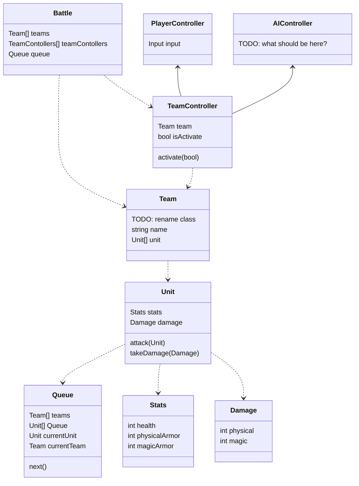

# Turned-base RPG

## Architecture

```mermaid
classDiagram

class Battle {
  Team[] teams
  TeamContollers[] teamContollers
  Queue queue
}
Battle ..> Team
Battle ..> TeamController

class Unit {
  Stats stats
  Damage damage
  attack(Unit)
  takeDamage(Damage)
}
class Stats {
  int health
  int physicalArmor
  int magicArmor
}
class Damage {
  int physical
  int magic
}

Unit ..> Queue
Unit ..> Stats
Unit ..> Damage

class Queue {
  Team[] teams
  Unit[] Queue
  Unit currentUnit
  Team currentTeam
  next()
}


class Team {
  TODO: rename class
  string name
  Unit[] unit
}
Team ..> Unit

class TeamController {
  Team team
  bool isActivate
  activate(bool)
}
TeamController ..> Team

class PlayerController {
  Input input
}
PlayerController <-- TeamController

class AIController {
 TODO: what should be here?
}
AIController <-- TeamController

```
